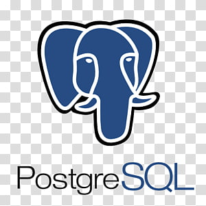

<h1 align="center">Hi, I'm Sampath Angara </h1>
<h3 align="center">Software Engineer from Visakhapatnam.</h3>

 

 <h3>Profile Views :-</h3>  
  

 

- I have 3+ years of experience working in areas mainly focused on backend development, database internals development and CI/CD development.

- I’m very enthusiastic about web scraping and extracting some valuable insights from the data I scraped.

- I'm interested in exploring new opportunities in backend development, web crawling and database development.

 

<h3>Connect with me:</h3>

  
  
   
    

 

<h3 align="left">Languages and Tools:</h3>

 
 
  
  
  
  
  
  

 

<!-- <h3>Statistical Data :-</h3>

 

&nbsp;

 

 

------------------------------------------------------------------------------------------------------------------------------------------ -->
